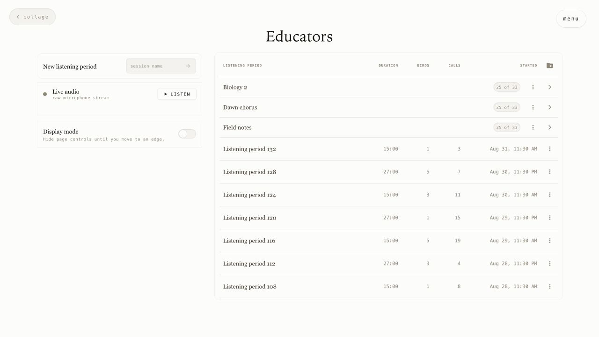
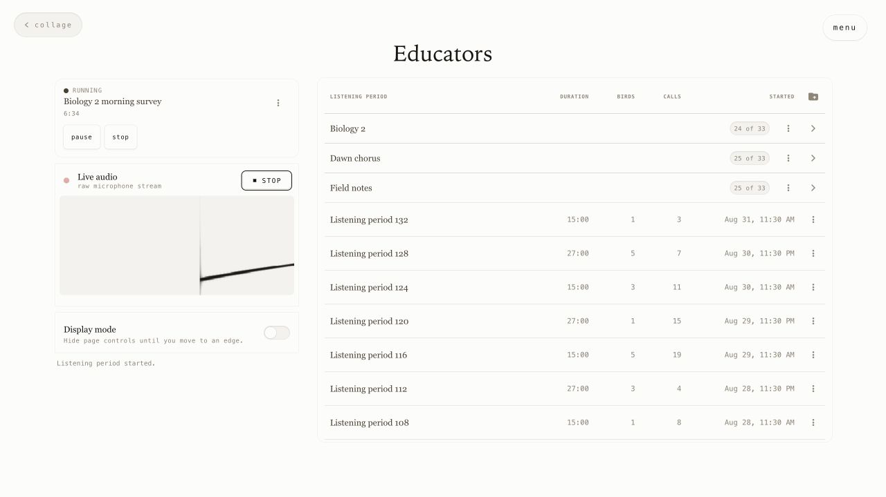
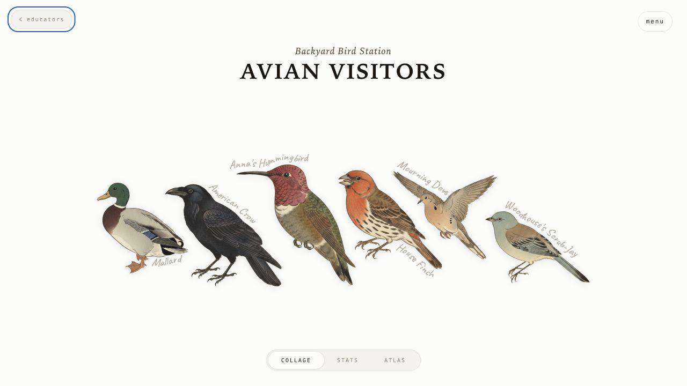

# Educators mode

Read this guide on the web at [avianvisitors.com/educators](https://avianvisitors.com/educators).

Educators mode adds a classroom workspace to Avian Visitors. Use it to follow the birds outside in real time, save listening periods, and compare what different classes or groups hear.



*Start a listening period and return to saved class work from the same page.*

## Set it up

Educators mode is optional and stays off until you enable it.

For a new station, add `--educators` to the installer:

```bash
curl -fsSL https://raw.githubusercontent.com/Twarner491/AvianVisitors/avian-visitors/newinstaller.sh | bash -s -- --educators
```

For an existing station, first use **Tools > Pull latest** or follow the [update instructions](../README.md#updating-an-existing-station). Then run:

```bash
sudo /usr/local/sbin/avian-educators enable
```

You can check whether it is enabled:

```bash
sudo /usr/local/sbin/avian-educators status
```

To turn Educators mode off:

```bash
sudo /usr/local/sbin/avian-educators disable
```

Turning it off hides the Educators page. Your saved periods and folders will be there if you enable it again.

## Start a listening period

Open **Educators** from the Avian Visitors menu. Enter a name such as `Biology 2` or `Morning bird walk`, then press the arrow.

The Collage, Stats, and Atlas now follow what the group hears during that period. Use **Pause** for a break, **Resume** when the group is ready, and **Stop** when the activity is finished.



*Listen to the microphone and watch the spectrogram while the class observes.*

The **Listen** row opens the station microphone and spectrogram. Live audio works on a direct connection to the station's local network. Some microphones cannot play live audio while BirdNET is recording, but detections will continue normally.

## Organize and revisit class work

Saved listening periods appear on the right. Click one to see only the birds heard during that activity. Its Collage, Stats, Atlas, and available recordings stay together as a saved view.

Use folders for classes, clubs, or projects. Selecting a folder combines the birds heard across every listening period inside it. The three-dot menu lets you move, rename, or remove an item.



*Open a saved period or folder, then use Back to Educators to return to the workspace.*

Removing a listening period removes it from Educators mode. It does not delete the BirdNET detections or recordings. Removing a folder returns its periods to the unfiled list.

## Share a saved view

Each saved period or folder has its own URL. Copy that address to share the selected Collage, Stats, or Atlas with someone who can reach the station.

These links are unlisted and read-only. They do not give access to Educators controls, live audio, or downloads. Removing the saved item, or turning off Educators mode, closes its link.

## Put it on a classroom display

Turn on **Display mode** to hide the menu, time window, and page selector. Move the pointer or keyboard focus to the top or bottom edge, or touch either edge, to bring the controls back.

Display mode affects only the browser where you turn it on. It does not put the browser into fullscreen.

## Download class data

Open **Tools** to download detections as a spreadsheet (CSV) or collect available recordings. If a saved period or folder is open, the download follows that selection.

Saved-view downloads are available only through a direct connection to the station's local network.

## Keep exploring

- [Avian Visitors source and setup](https://github.com/Twarner491/AvianVisitors)
- [BirdNET-Pi overview](https://birdnet.cornell.edu/birdnet-pi/)
- [BirdNET learning activities for K-12 classrooms](https://birdnet.cornell.edu/k12/)
- [BirdNET tutorials and further reading](https://birdnet.cornell.edu/resources/)
