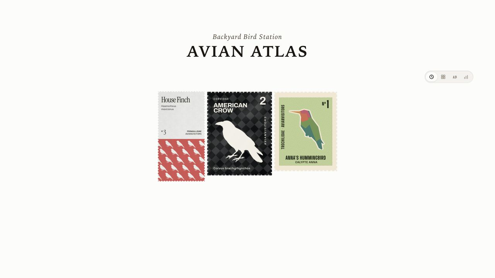
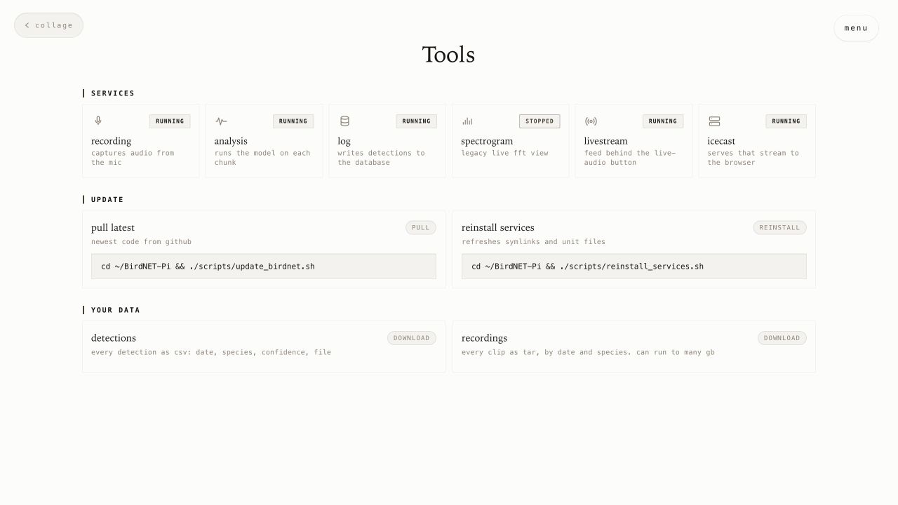

# Avian Visitors V1.2

Avian Visitors v1.2 adds an optional Educators mode for following birds with a class, saving listening periods, and returning to what each group heard.


*The classroom workspace keeps a new activity and saved class work in one place.*

## Listening periods follow the class

Give a listening period a name and press the arrow to begin. While it is running, the Collage, Stats, and Atlas follow the birds heard by the group. Pause for a break, resume when everyone is ready, and stop to save the activity.

The **Listen** row opens the station microphone and spectrogram on the local network, so a class can hear and see what BirdNET is hearing.


*The live player and spectrogram expand only when the class wants to listen.*

## Saved views make comparison easy

Open a saved period to revisit its birds, recordings, Stats, and Atlas. Folders can collect periods for a class, club, field trip, or longer project. Selecting a folder combines everything heard across the periods inside it.

Each saved period or folder also has its own URL. A teacher can copy that read-only link for someone who can reach the station. Shared links do not open Educators controls, live audio, or downloads.


*A saved view can be revisited or shared without exposing classroom controls.*

## A quieter classroom display

Display mode hides the menu, time window, and page selector while a Collage, Stats, or Atlas page is on screen. The controls return when the pointer, touch, or keyboard focus reaches the top or bottom edge.

Display mode stays in that browser. It does not use fullscreen.



*Display mode leaves the selected bird page on screen and brings its controls back only when they are needed.*

## Downloads stay with the teacher

Teachers can use **Tools** to download a spreadsheet of detections or collect available recordings for the selected period or folder. Saved-view downloads require a direct connection to the station's local network.

Listening periods use the station's existing BirdNET detections and recordings. Removing a period does not delete them, and recordings still follow the station's usual cleanup settings.



*The familiar Tools page keeps classroom downloads with the rest of the station's data tools.*

## Time windows can follow the day

Settings now includes an optional **Reset at midnight** switch. When it is on, longer rolling views begin at the station's local midnight instead of including birds from yesterday.

## Enable Educators mode

For a new station, add `--educators` to the installer:

```bash
curl -fsSL https://raw.githubusercontent.com/Twarner491/AvianVisitors/avian-visitors/newinstaller.sh | bash -s -- --educators
```

For an existing station, first update with **Tools > Pull latest** or the [documented updater](../../../README.md#updating-an-existing-station), then run:

```bash
sudo /usr/local/sbin/avian-educators enable
```

See the [Educators guide](https://avianvisitors.com/educators) for the full classroom workflow.

## Keep exploring with BirdNET

- [BirdNET-Pi overview](https://birdnet.cornell.edu/birdnet-pi/)
- [BirdNET learning activities for K-12 classrooms](https://birdnet.cornell.edu/k12/)
- [BirdNET tutorials and further reading](https://birdnet.cornell.edu/resources/)
